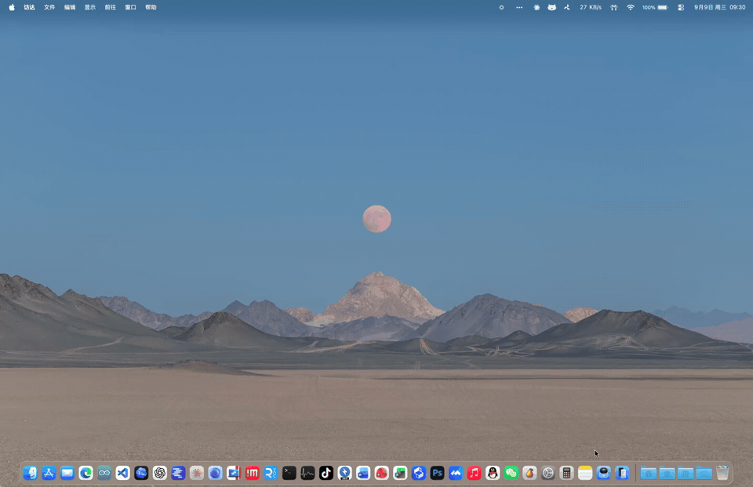
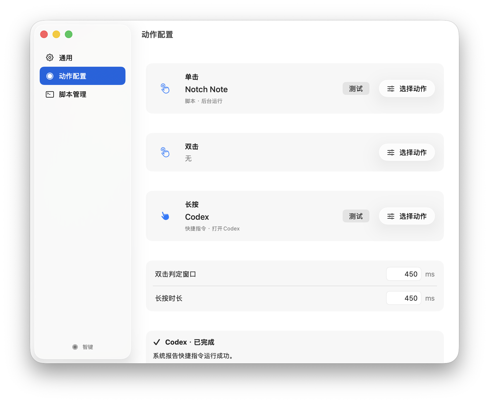
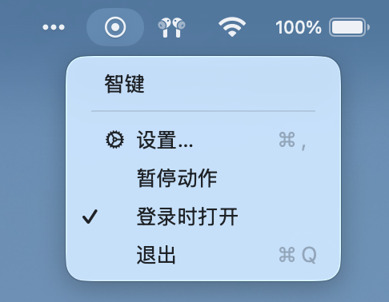
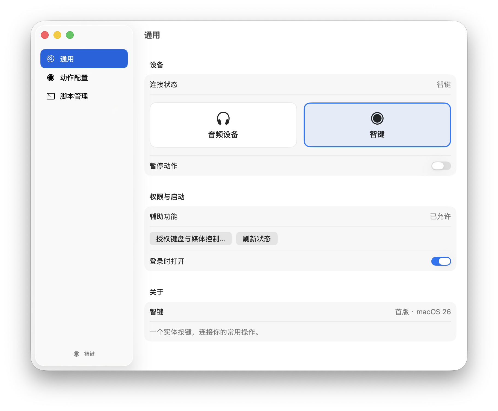
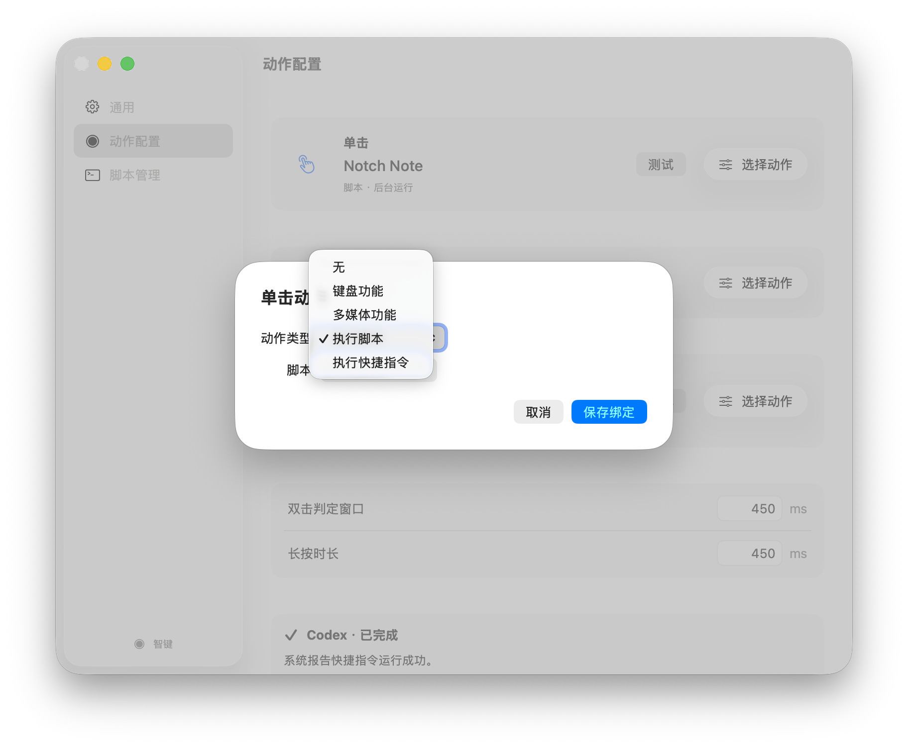
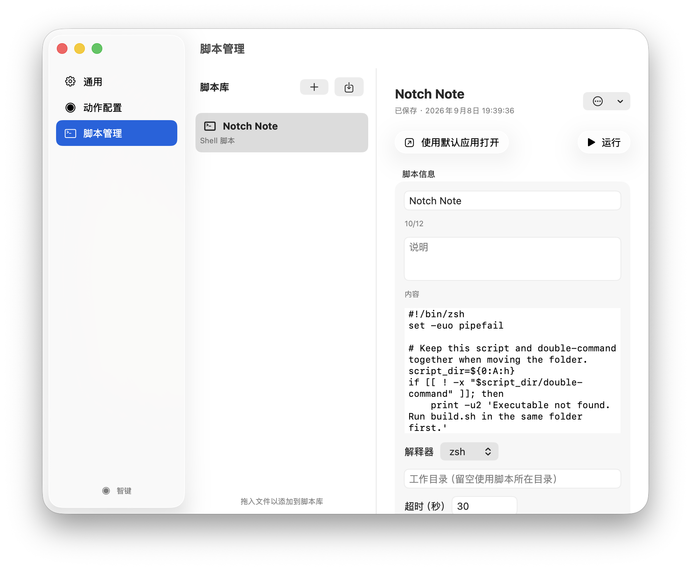
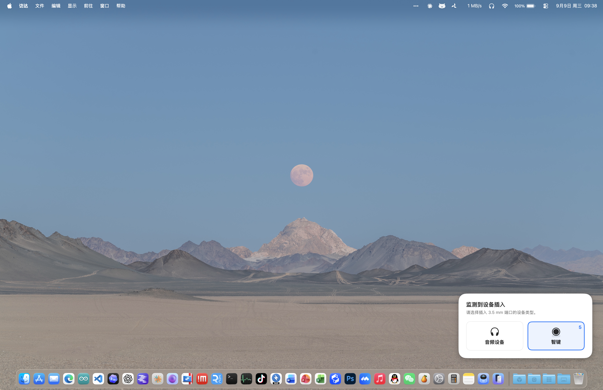

<p align="center">
  
</p>

# 智键 · smartKey for macOS

**简体中文** | [English](README.en.md)

让十年前插在手机耳机孔里的小按钮，在 Mac 上继续发挥作用。

smartKey 为老款 **3.5 mm 智键硬件提供 macOS 适配**：把单击、双击和长按绑定到键盘快捷键、多媒体控制、Shell 脚本或系统快捷指令。它常驻菜单栏，用一个实体按钮连接你的常用操作。

**macOS 26+ · 原生 Swift / SwiftUI · MIT 许可证 · 中文界面**

## 为什么做这个项目

如果你还记得十年前插在手机耳机孔上的「智键」，这个项目就是想让这件老硬件在今天的 Mac 上继续使用。关于这类硬件的背景，可以参考 B 站视频：[《手机上的这个小玩意儿，你用过吗？》](https://www.bilibili.com/video/BV1714y1Z7QQ/)。该视频是硬件介绍，下面的演示与截图来自本项目。

这是个人适配项目，与原硬件厂商无隶属关系。项目提供中英文 README。精力有限，**程序目前仅提供中文界面，不提供英文版程序，欢迎社区自行适配其他界面语言或提交贡献**。

## 演示



[查看 MP4 录屏](docs/assets/demo.mp4)。演示中的 **Notch Note** 和截图中的 **Codex** 是个人配置的动作示例，不是应用内置功能，也不是使用智键的必需依赖。首次启动时，三种手势都没有绑定动作。

## 可以做什么

| 功能 | 说明 |
| --- | --- |
| 三种手势 | 分别配置单击、双击和长按；支持调整双击判定窗口、长按时长 |
| 键盘功能 | 录制单键或组合键，例如切换窗口、触发应用快捷键 |
| 多媒体功能 | 播放 / 暂停、上一首、下一首、音量增减、输出静音 |
| 执行脚本 | 管理 zsh / bash 脚本，配置工作目录、环境变量和超时，查看运行结果 |
| 执行快捷指令 | 选择本机系统快捷指令，按其 ID 绑定并运行 |
| 设备与音频 | 插入时选择「音频设备」或「智键」，在智键模式下把音频输出保持在其他设备 |
| 菜单栏与反馈 | 暂停 / 恢复动作、登录时打开、按压动效与 Liquid Glass 动作名称气泡 |



<details>
<summary>更多截图：菜单栏、通用设置、动作选择、脚本管理与设备插入</summary>

菜单栏：



通用设置：



选择动作：



脚本管理：



设备插入提示：



</details>

截图与录屏记录了开发时的界面和个人配置，具体功能以当前代码为准。

## 使用条件与兼容范围

- **macOS 26 或更新版本**。项目使用 macOS 26 的原生 Liquid Glass API，暂未适配旧系统。
- **带内置 3.5 mm 耳机接口的 Mac 与老款智键硬件**。后端只接收内置音频链路中 `Transport=Audio` 的 Consumer Control 事件。
- **另一个可用的音频输出**，例如内建扬声器、蓝牙耳机或 USB 音频设备。智键占用耳机孔后，程序需要把声音切换到其他输出。
- 从源码构建需要 **完整 Xcode 26 或更新版本**（含 macOS 26 SDK 和 Swift Testing）。项目使用 Swift Package Manager，没有第三方包依赖。

目前没有完整的 Mac 型号与智键批次兼容清单，欢迎提供实测结果。**USB / USB-C 转 3.5 mm 转接器、USB 按钮和蓝牙按钮不在当前支持范围内**；蓝牙 / USB 音频设备可以作为声音输出，但不能因此作为智键输入使用。

## 构建与安装

下载源码 ZIP 并解压，或克隆仓库，然后在终端进入项目根目录。当前提供源码构建方式；仓库中的脚本生成本机 ad-hoc 签名应用，不包含 Developer ID 签名或公证流程。

先构建应用：

```bash
./scripts/build-app.sh
```

产物位于 `.build/release-app/smartKey.app`。此命令只构建并验证签名，不安装或启动应用；默认构建当前 Mac 架构，不是 Universal Binary。

安装并启动：

```bash
./scripts/install-app.sh
```

安装脚本会退出已运行的 smartKey，重新构建 release 版本，覆盖 `/Applications/smartKey.app`，并清理旧名 `/Applications/智键.app`。用户配置单独保存在 Application Support 中。首次从 `/Applications` 启动会尝试注册登录项，可在菜单栏或通用设置中关闭「登录时打开」。

开发时也可以直接运行：

```bash
DEVELOPER_DIR=/Applications/Xcode.app/Contents/Developer swift run smartKey
```

如果 Xcode 安装在其他位置，请使用对应的 `DEVELOPER_DIR`。构建脚本会优先使用 `/Applications/Xcode.app`。仅安装 Command Line Tools 可能无法编译测试中的 `Testing` 模块。

## 第一次使用

1. 启动应用，在菜单栏找到智键图标；应用不显示 Dock 图标。
2. 插入智键，在右下角提示中选择「智键」。提示默认倒计时 5 秒后使用当前选项，首次默认选中智键；之后记住上次选择。插入普通耳机时请选择「音频设备」。
3. 按提示选择声音输出。只有一个可用的非耳机孔输出时会自动选择；有多个时由你确认。音频切换及 HID 连接成功后，才开始接收按键。
4. 打开「设置 → 动作配置」，为单击、双击或长按选择动作并保存绑定。需要键盘或媒体事件控制时，在「通用」中按提示授予辅助功能权限。
5. 点击「测试」检查绑定，再用实体按钮触发。键盘测试会留出 3 秒供你切换目标应用；测试会真实执行所选动作。

配置双击动作后，单击需要等待双击判定窗口；清空双击绑定后，单击松开即判定。长按到阈值执行一次，松开不再补发单击。双击窗口和长按时长默认均为 450 ms。

## 脚本与快捷指令

在「脚本管理」中新建、导入或拖入脚本。导入会复制到应用的脚本库，原文件保持不变；界面提供只读源码预览，通过「使用默认应用打开」在文本编辑器中修改。每次执行读取已保存的最新内容。

脚本以当前用户权限在后台非交互运行，支持 zsh / bash、工作目录、环境变量和超时，默认超时 30 秒。同时最多运行一个脚本，重复触发不排队。导出 `.smartkeyscript` 包包含源码和元信息，不含环境变量或外部依赖；普通 `.sh` 导出只含源码。依赖相邻文件的脚本导入后，需要自行处理依赖路径。

快捷指令从本机列表选择，绑定使用系统 ID，重命名后仍可使用。默认等待超时 300 秒，同时最多等待一个快捷指令，与脚本互相独立。首次执行可能需要系统授权或交互；「停止等待」只能回收本地命令进程，快捷指令可能仍在系统中运行。

脚本和快捷指令会执行你配置的真实操作，请先检查导入内容。运行结果可在设置中查看，动作气泡只显示名称。详细约定见 [动作扩展与脚本运行说明](docs/action-development.md)。

## 常见问题

**插入后没有反应？** 确认连接的是 Mac 内置 3.5 mm 接口，设备模式选择了智键，有可用的其他音频输出，并已完成 HID 连接。退出可能占用该线控设备的其他程序，再尝试重新插入。不同硬件的兼容性仍需要实测。

**声音为什么没有从耳机孔输出？** 智键模式会把默认音频输出切到你选择的设备，防止声音被送进按钮。普通耳机请在「设置 → 通用」切换为音频设备。暂停动作仍保留设备模式和音频保护。

**脚本在终端能运行，在智键中失败？** 脚本以后台非交互方式执行，工作目录默认是托管脚本所在目录，也不会自动加载交互终端环境。检查依赖路径、解释器、工作目录和环境变量，具体规则见开发说明。

**播放或音量控制与预期不同？** 播放类命令由系统媒体路由决定接收应用；音量和输出静音要求当前音频设备支持软件控制，不是麦克风静音。

**配置在哪里？如何卸载？** 配置与脚本位于 `~/Library/Application Support/smartKey/`。`smartKey.conf` 保存后热更新，手动修改 `actions.json` 则需重启。卸载前关闭「登录时打开」并退出应用，再将 `/Applications/smartKey.app` 移到废纸篓；需要清除个人数据时，可备份后手动移除上述配置目录。

## 开发与贡献

```bash
DEVELOPER_DIR=/Applications/Xcode.app/Contents/Developer swift test
```

默认测试使用模拟设备、临时配置和临时脚本，不切换真实音频输出、不独占真实 HID。实际插拔、物理按键、系统授权和睡眠唤醒仍需硬件验收。GitHub Actions 配置会执行测试与应用打包，不能替代硬件验证。

| 目录 | 内容 |
| --- | --- |
| `Sources/SmartKey` | 耳机孔检测、HID 按键、手势识别、音频输出保护 |
| `Sources/SmartKeyActions` | 动作定义、配置存储、脚本库与动作执行器 |
| `Sources/smartKeyPopup` | 菜单栏、原生设置、设备选择与动效 |
| `Tests` | 动作、手势、配置、设备流程与界面渲染测试 |
| `scripts` / `packaging` | 构建、安装、图标与应用元信息 |

欢迎通过 Issue 提供硬件兼容信息或复现步骤，也欢迎改进代码、文档和语言适配。维护精力有限，不保证及时处理所有反馈。

- [贡献指南](CONTRIBUTING.md)
- [使用与配置详解](docs/usage.md)
- [动作扩展与脚本运行说明](docs/action-development.md)
- [首版验证记录（历史）](docs/v1-validation.md) · [快捷指令验证记录（历史）](docs/shortcuts-validation.md)
- [维护者上传与发布说明](docs/publishing.md)
- [本次上传准备验证记录](docs/github-preparation-validation.md)

## 许可证

项目代码采用 [MIT License](LICENSE)。外链视频以及截图、录屏中出现的第三方应用、商标和桌面壁纸，其权利归各自权利人所有。
